  

## 📌 About Me
- 🎨 UI/UX Designer passionate about crafting clean, intuitive & user-centered experiences
- 💻 Full Stack Developer building scalable and modern web applications
- 🚀 COO @ Adapts.co — leading product vision, design & innovation
- 💡 I love blending design + code to create impactful digital solutions
- 🌱 Currently exploring Machine Learning, System Design & scalable architectures
- ✨ Strong focus on design thinking, usability & performance
- 🤝 Open to collaborating on creative, AI-driven & impactful tech projects
- 📄 Working on research papers & IEEE publications
- 🔥 Turning ideas into real-world products through design + development
- 📈 Continuously learning, building & growing as a designer, developer & entrepreneur

## 🧠 My Focus Areas
- 💻 Full Stack Web Development
- 🎨 UI/UX Design & User Experience Engineering
- 🤖 Artificial Intelligence & Generative AI
- 🧠 Machine Learning & Applied AI Solutions
- ⚙️ System Design & Scalable Architectures
- 🚀 Product Development & Innovation
- 👥 Human-Centered Design & Design Thinking

## 📊 GitHub Stats & Trophies

  
  

  

## 🛠️ Languages & Tools

> ## Programming Languages

      

> ## Frontend

     

> ## Backend

 

> ## Database

 

> ## DevOps & Cloud

> ## Tools

   

## 🔗 Connect with Me

  

<picture>
  <source media="(prefers-color-scheme: dark)" srcset="https://raw.githubusercontent.com/abozanona/abozanona/output/pacman-contribution-graph-dark.svg">
  <source media="(prefers-color-scheme: light)" srcset="https://raw.githubusercontent.com/abozanona/abozanona/output/pacman-contribution-graph.svg">
  
</picture>

  

